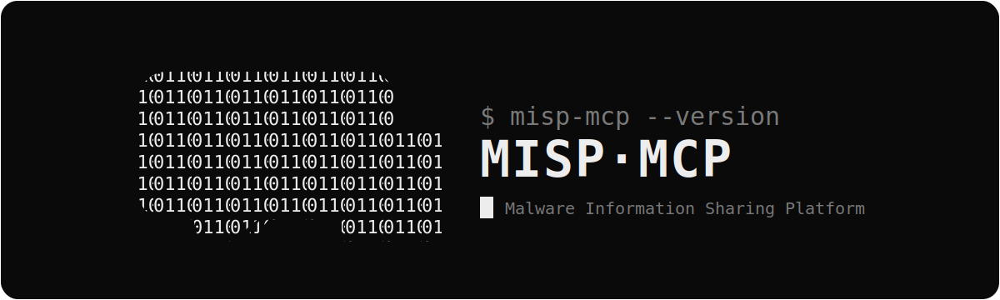

<p align="center">
  <picture>
    <source media="(prefers-color-scheme: light)" srcset="assets/banner-light.svg">
    
  </picture>
</p>

<p align="center">
  Ask about a threat indicator in plain language and get an answer from MISP.
</p>

<p align="center">
  
  
  
  
</p>

---

misp-mcp connects MISP to any [MCP](https://modelcontextprotocol.io) client
(Claude Desktop, Claude Code, Cursor, and others). You ask in plain language,
the client calls MISP, you get the answer. No MISP UI, no REST calls by hand.
Eight tools read from MISP and two add indicators (single + bulk), all under your own MISP
key.

---

## Connect to the hosted server

> The server runs at `https://misp.example.com/mcp`. There is nothing to
> install; point your MCP client at it with your own MISP key. You must be on the
> your corporate network or VPN (the endpoint is not on the public internet).

### 1. Get your MISP key (one time)

1. Open `https://misp.example.com` and log in.
2. Top-right menu → **My Profile → Auth Keys → Add authentication key**.
3. Comment it `misp-mcp <your-name>`, then **copy the key** - MISP shows it once.
   A read-only key is enough for lookups.

Keep the key private - every query runs *as you*.

### 2. Connect your MCP client

This is a standard remote MCP server over streamable HTTP, so any MCP-capable
client works - Claude Desktop, Claude Code, Cursor, Windsurf, Cline, Continue,
Zed, VS Code (Copilot/MCP), Goose, and others. Whatever the client, it needs the
same three things:

1. Transport: **HTTP** (streamable HTTP / remote MCP)
2. URL: `https://misp.example.com/mcp`
3. Two headers: `X-MISP-Key: YOUR_KEY_HERE` and `X-MISP-User: you@example.com`

**Generic config** - most clients read a JSON block like this (the key names
vary slightly by client - `mcpServers`, `servers`, or `mcp.servers`; check your
client's docs, the values are identical):

```json
{
  "mcpServers": {
    "misp": {
      "type": "http",
      "url": "https://misp.example.com/mcp",
      "headers": {
        "X-MISP-Key": "YOUR_KEY_HERE",
        "X-MISP-User": "you@example.com"
      }
    }
  }
}
```

<details>
<summary><b>Per-client examples</b></summary>

**Claude Code** (one command in a terminal):

```bash
claude mcp add --transport http misp https://misp.example.com/mcp \
  --scope user \
  --header "X-MISP-Key: YOUR_KEY_HERE" \
  --header "X-MISP-User: you@example.com"
```

**Claude Desktop / Cursor / Windsurf** - add the generic `mcpServers` block
above to the client's MCP JSON config, then fully restart the app.

**VS Code (Copilot MCP)** - in `.vscode/mcp.json` or user settings, under
`"servers"`:

```json
{
  "servers": {
    "misp": {
      "type": "http",
      "url": "https://misp.example.com/mcp",
      "headers": {
        "X-MISP-Key": "YOUR_KEY_HERE",
        "X-MISP-User": "you@example.com"
      }
    }
  }
}
```

**Cline / Continue / Zed / Goose and other clients** - use the same URL,
`http` transport, and the two headers, in whatever config format the client
uses. Anything that speaks remote MCP over HTTP and can send custom headers
will work; the two `X-MISP-*` headers are the only server-specific part.

Any client that cannot send custom HTTP headers is not supported (the key must
ride in `X-MISP-Key`).

</details>

### 3. Check it works

Reachability check (client-agnostic) - should print `401`, which proves you can
reach the endpoint and that auth is required:

```bash
curl -s -o /dev/null -w '%{http_code}\n' -X POST https://misp.example.com/mcp
```

If your client has a way to list MCP servers, confirm `misp` shows connected
(Claude Code: `claude mcp list` → `misp ... ✓ Connected`; other clients show it
in their MCP/tools panel).

Then ask your assistant these - if they answer from MISP, you're set:

| Ask this | You should get |
|---|---|
| `Is MISP healthy?` | reachable, MISP + server version |
| `Look up 102.130.113.9 in MISP.` | hits (Tor / DDoS), detection-flagged |
| `Look up 45.9.148.99 in MISP.` | "not seen in MISP" (not "safe") |
| `Triage these against MISP: 8.8.8.8, evil.com, <a hash>` | per-indicator verdicts |

**Not working?**
- 401 / timeout when asking → you're not on your network / VPN.
- `claude mcp list` not "Connected" → re-check the key and headers.
- Tools missing, stale, or the assistant says "no such tool" → **reconnect** (below).

### Reconnect / restart it

MCP clients cache the tool list when they connect. If the server stops
responding, shows the wrong tools, or was updated, the fix in every client is
the same: **fully quit and reopen the app** (not just the conversation or
window - an in-app `/mcp` reconnect or a new chat is often not enough). If tools
are still stale, remove the `misp` server from the config, save, reopen, add it
back, and reopen again.

New tools added on the server only appear after this full restart.

<details>
<summary><b>Claude Code re-register</b></summary>

```bash
claude mcp remove misp
claude mcp add --transport http misp https://misp.example.com/mcp \
  --scope user \
  --header "X-MISP-Key: YOUR_KEY_HERE" \
  --header "X-MISP-User: you@example.com"
```
Then quit Claude Code completely and reopen it. Check with `claude mcp list` →
`misp ... ✓ Connected`, and `/mcp` shows the current tools.

</details>

---

## What you can ask

```
"Look up 102.130.113.9 in MISP."
"Triage these 30 IOCs from the report."
"What else showed up in the same event as evil[.]com?"
"Review the last 30 days of IOC submissions - who added what."
"Is MISP healthy? How many feeds are on?"
```

Behind the scenes the client calls a tool and gets structured JSON, e.g. for a
lookup:

```json
{
  "ioc": "102.130.113.9",
  "ioc_type": "ipv4",
  "total_hits": 6,
  "summary": {
    "seen_in_misp": true,
    "event_count": 6,
    "detection_flagged": true,
    "max_threat_level": "Medium",
    "restricted_hits": 0
  },
  "hits": [
    { "event_id": "16989", "event_info": "Tor exit nodes feed",
      "attribute_type": "ip-dst", "value": "102.130.113.9",
      "to_ids": true, "restricted": false }
  ]
}
```

## Tools

| Tool | | What it does |
|---|---|---|
| `misp_lookup_ioc` | read | Sightings of one IPv4/IPv6, domain, URL, or hash, with a verdict |
| `misp_lookup_iocs` | read | Triage many indicators in one call |
| `misp_correlate_ioc` | read | Other indicators in the same event, for pivoting |
| `misp_get_event` | read | One event: info, tags, attributes |
| `misp_search_events` | read | Search events by title, tag, or date |
| `misp_feed_stats` | read | How many feeds exist and which are on |
| `misp_instance_status` | read | Reachability + auth check; run first when a tool fails |
| `misp_review_submissions` | read | Audit recent submissions: what was added, by whom, what's detection-flagged |
| `misp_submit_ioc` | **write** | Add a new indicator (needs a write-capable key) |
| `misp_submit_iocs` | **write** | Bulk: validate + add many indicators (dry-run preview first) |

Paste indicators however you have them - defanged forms (`1.2.3[.]4`,
`hxxp://evil[.]com`) are cleaned up automatically. Private/reserved IPs are
rejected (not routable, can't identify an external threat).

## Security

- **Your key is the authorization.** MISP checks it on every call and attributes
  the action to you. A read-only key cannot write; only write-capable keys (the
  security team) can add indicators.
- **Guarded write path.** Submissions are rate-limited, well-known / first-party
  infrastructure can never be submitted, and the submitter is read from MISP
  itself - not a value the caller sets (so `misp_review_submissions` shows who
  *actually* added each IOC).
- **MISP content is data, not instructions.** Don't submit an indicator from a
  lookup without checking it yourself.
- **Keys stay private.** No shared key on the server; the key rides in a header
  over TLS. Logs never contain keys or IOC values.

## Architecture

The shape is the same on any host: callers reach misp-mcp over HTTPS through a
TLS-terminating load balancer (or the process's own cert), and misp-mcp calls
your MISP. It holds no credential of its own - every request carries the
caller's own `X-MISP-Key`, which MISP validates and attributes to that user.

```
  MCP client  (any client, on an allowed network / VPN)
       │
       │  HTTPS  +  header  X-MISP-Key: <your key>
       ▼
  Load balancer            TLS termination · ingress limited to allowed CIDRs
       │  HTTP :8080  (private)
       ▼
  misp-mcp                 container / VM, no stored secret
       │  HTTPS
       ▼
  your MISP instance
```

- TLS terminates at the load balancer; misp-mcp serves plain HTTP on `:8080`
  behind it (or give the process its own cert, see [DEPLOY.md](DEPLOY.md)).
- Ingress is scoped to your caller networks; the endpoint is not public.
- Two common topologies: run misp-mcp **standalone** in front of a separate
  MISP (the Terraform module below), or **co-locate** it beside an existing
  MISP behind one load balancer with a `/mcp*` path rule so MISP is untouched.

## Host it (local, self-host, or cloud)

- **Local** (in your MCP client, against your own MISP): install and add the
  `misp-mcp` binary - see [ONBOARDING.md](ONBOARDING.md).
- **Self-host** for a team (HTTP server behind TLS, EC2/VM + systemd):
  [DEPLOY.md](DEPLOY.md).
- **Cloud, any provider** (AWS / GCP / Azure guidance): [CLOUD.md](CLOUD.md).
- **AWS, one command** - a ready Terraform module (ECS Fargate + internal ALB +
  TLS, no VM to manage): [deploy/terraform/](deploy/terraform/). Fill in a
  `.tfvars`, `terraform apply`, and it prints the `/mcp` endpoint.

Automated local setup:

```bash
git clone https://github.com/indranilroy99/misp-mcp.git
cd misp-mcp
./install.sh
```

<details>
<summary><b>All settings</b></summary>

| Setting | Mode | Default | Meaning |
|---|---|---|---|
| `MISP_URL` | both | required | MISP base URL |
| `MISP_API_KEY` | local | required | your key (local mode) |
| `MCP_TRANSPORT` | both | `stdio` | `stdio` for local, `http` for hosted |
| `MCP_HOST` | hosted | `127.0.0.1` | bind address |
| `MCP_PORT` | hosted | `8080` | port |
| `MISP_VERIFY_TLS` | both | `true` | set `false` only for a self-signed lab |
| `MISP_MCP_SHOW_RESTRICTED` | both | `true` | `false` turns on server-side TLP hiding |
| `MISP_SUBMISSION_EVENT_ID` | both | required for writes | event that `misp_submit_ioc` writes to |
| `MISP_MCP_PROTECTED_DOMAINS` | both | empty | your own domains that can never be submitted |
| `MISP_MCP_SUBMIT_RATE` | both | `20` | max submissions per key per minute |
| `MISP_MCP_TLS_CERT` / `MISP_MCP_TLS_KEY` | hosted | none | serve HTTPS directly |
| `MISP_MCP_ALLOW_INSECURE_BIND` | hosted | `false` | allow a public plain-HTTP bind (TLS on a proxy) |

</details>

<details>
<summary><b>Development</b></summary>

```bash
python3 -m venv .venv
.venv/bin/pip install -e '.[dev]'
.venv/bin/python -m pytest tests/ -q            # 51 tests
```

```
misp_mcp/
  server.py      the 10 tools and the MCP server
  client.py      talks to the MISP REST API (read + write)
  config.py      reads settings from the environment
  http_app.py    hosted mode: header auth + web server
  context.py     carries your identity through one request
  validators.py  cleans, checks, and safelists indicators
```

Dependencies are pinned in `pyproject.toml`: `mcp`, `httpx`, `pydantic`,
`uvicorn`, `starlette`.

</details>

<details>
<summary><b>Security reporting &amp; license</b></summary>

Report vulnerabilities privately - see [SECURITY.md](SECURITY.md). Licensed under
Apache-2.0 ([LICENSE](LICENSE)). Contributions welcome - see
[CONTRIBUTING.md](CONTRIBUTING.md).

</details>
